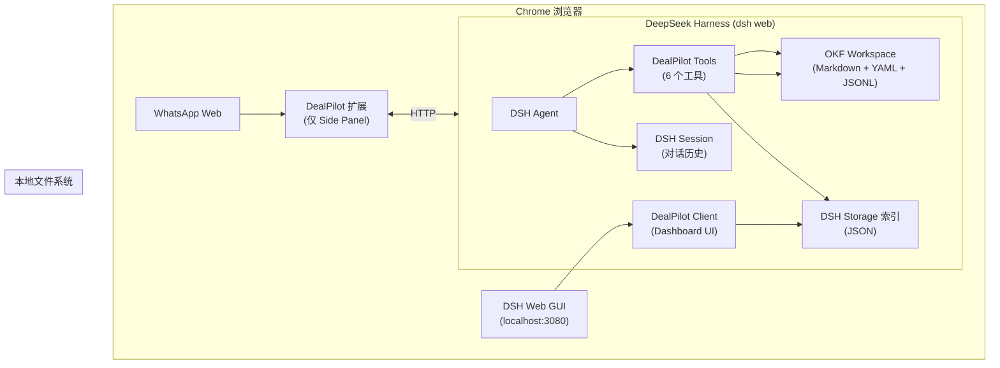

# DealPilot DSH 系统架构 V0.1

## 0. 架构结论

DealPilot DSH 版是一个 **DSH 插件包**，运行在 DeepSeek Harness 的 Web 模式上。不需要自建 Agent Runtime、不需要管理外部进程、不需要 Native Messaging 协议。



**核心分工**：

| 组件 | 职责 | 是否调用 LLM |
|---|---|---|
| DSH Agent | 理解用户意图，规划工具调用，生成回复 | 是 |
| DealPilot Tools | 确定性读写 OKF，维护业务状态 | 否 |
| DealPilot Client | 渲染 Dashboard UI（侧边栏 + 工作台） | 否 |
| DSH Session | 自动记录对话历史和工具调用 | 否 |
| Chrome 扩展 | WhatsApp DOM 观察 + 草稿插入 | 否 |
| OKF Workspace | 权威业务状态 | 不适用 |

---

## 1. 系统架构

### 1.1 DSH 插件包架构

DealPilot 在 DSH 中表现为一个**插件包**（类似 `dsh1024`），通过 `cordis.patch.yml` 插入到 DSH 的 composition 中。

```
DSH Profile (profiles/web/)
│
├── @deepseek-ai/dsh-base          ← DSH 基础（工具注册表、沙箱）
├── @deepseek-ai/dsh-web-app       ← DSH Web GUI（Slot 系统）
├── dealpilot-dsh                  ← ★ DealPilot 插件包
│   ├── lib/index.ts               ← Host 端：注册 6 个 Tool
│   ├── client/client.ts           ← Client 端：注册 Dashboard UI
│   └── agent-preset/              ← Agent Preset：工具 + persona
└── cordis.patch.yml               ← 用户覆盖层
```

### 1.2 两层平面

| 平面 | 内容 | 生命周期 |
|---|---|---|
| **Host** | DealPilot Tools 注册、OKF 读写、Storage 索引管理 | 进程级（DSH 运行时） |
| **Agent Preset** | Persona、工具目录、prompt 段 | 每会话独立 |

DealPilot 的所有 6 个工具注册在 Host 的 `tools` 注册表中，通过 Agent Preset 暴露给 Agent。

### 1.3 数据流

```
用户对话 "把 Acme 标记为高风险"
        │
        ▼
┌─────────────────┐
│  DSH Agent       │  理解意图 → 选择工具 → 调用 dealpilot_write
└────────┬────────┘
         │ tool/call
         ▼
┌─────────────────┐
│  dealpilot_write │  1. 读取 deals/acme-corp.md
│  (Host Tool)     │  2. 修改 YAML frontmatter (risk_level: high)
│                  │  3. 写回文件
│                  │  4. 追加 business-events.jsonl
│                  │  5. 更新 Storage 索引
└────────┬────────┘
         │ tool/result
         ▼
┌─────────────────┐
│  DSH Agent       │  返回操作结果给用户
└────────┬────────┘
         │
         ▼
┌─────────────────┐
│  Dashboard UI    │  用户点击刷新 → 读 Storage 索引 → 显示新状态
│  (Client)        │  （不调用 LLM）
└─────────────────┘
```

### 1.4 侧边栏刷新流程（零 LLM 调用）

```
用户点击 [刷新]
        │
        ▼
┌─────────────────────┐
│  Client: host.call   │  → "dealpilot:refresh-sidebar"
│  ('dealpilot:        │
│   refresh-sidebar')  │
└────────┬────────────┘
         │
         ▼
┌─────────────────────┐
│  Host: 读取 Storage  │  1. 读 ~/.dsh/storages/dealpilot/snapshot-cache.json
│  索引               │  2. 如果缓存过期，重新解析 OKF 文件
│                     │  3. 返回 Today 摘要 + 最近活动
└────────┬────────────┘
         │
         ▼
┌─────────────────────┐
│  Client: 渲染       │  更新侧边栏 UI（不调用 LLM）
└─────────────────────┘
```

---

## 2. 核心组件设计

### 2.1 DealPilot Tools（Host 端）

6 个工具都注册在 DSH 的 `tools` 注册表中，通过 Cordis `harness.registerTool()` 注册。

```
lib/
├── index.ts              ← 插件入口，注册所有工具
├── snapshot.ts           ← dealpilot_snapshot
├── write-tool.ts         ← dealpilot_write
├── action-tool.ts        ← dealpilot_action_transition
├── import-tool.ts        ← dealpilot_import
├── search-tool.ts        ← dealpilot_search
├── whatsapp-tool.ts      ← dealpilot_whatsapp
└── okf-utils.ts          ← 公共函数：YAML 解析、事件追加、索引更新
```

#### 工具注册模式

每个工具文件导出 `apply(ctx)` 函数：

```typescript
// lib/snapshot.ts
export function apply(ctx: CordisContext) {
  const harness = ctx.get('harness');
  if (!harness) return;

  harness.registerTool(ctx, harness.defineTool({
    name: 'dealpilot_snapshot',
    description: '...',
    parameters: { /* JSON Schema */ },
    output: { /* 渲染配置 */ },
    async execute(args) {
      // 工具逻辑
    }
  }));
}
```

#### 依赖关系

```
okf-utils.ts（公共层）
├── readYamlFrontmatter(filePath) → { meta, body }
├── writeYamlFrontmatter(filePath, meta, body) → void
├── appendBusinessEvent(workspace, event) → void
├── updateStorageIndex(workspace, entity, data) → void
├── readStorageIndex(workspace, entity) → object
├── validateWorkspace(workspace) → boolean
└── generateRef(entity, title) → string

snapshot.ts → okf-utils.ts
write-tool.ts → okf-utils.ts
action-tool.ts → okf-utils.ts
import-tool.ts → okf-utils.ts
search-tool.ts → okf-utils.ts
whatsapp-tool.ts → okf-utils.ts
```

### 2.2 DealPilot Client（Client 端）

Dashboard UI 注册到 DSH Web GUI 的 Slot 系统中：

```
client/
├── client.ts              ← 入口：注册 Slot
└── dashboard/
    ├── Sidebar.tsx         ← 侧边栏 Today 摘要
    ├── TodayView.tsx       ← 完整 Today 视图
    ├── CustomersView.tsx   ← 客户列表 + 详情抽屉
    ├── DealsView.tsx       ← 交易列表 + 详情抽屉
    ├── FunnelView.tsx      ← 漏斗图
    └── ActivityView.tsx    ← 活动时间线
```

#### Slot 注册

```typescript
// client/client.ts
export function apply(ctx) {
  const slots = ctx.get('slots');
  if (!slots) return;

  // 侧边栏：始终可见的 Today 摘要
  slots.inject('sidebar.section', () => slots.register(
    { name: 'sidebar.section', key: 'dealpilot-sidebar' },
    (props) => React.createElement(Sidebar, { ...props })
  ));

  // 完整工作台页面
  slots.inject('page.content', () => slots.register(
    { name: 'page.content', key: 'dealpilot-dashboard' },
    (props) => React.createElement(Dashboard, { ...props })
  ));
}
```

#### Host-Client 通信

```typescript
// Host 端注册处理函数
harness.handle('dealpilot:refresh-sidebar', async () => {
  const index = await readStorageIndex(workspace, 'snapshot');
  return { today: index.today, activity: index.recentActivity };
});

// Client 端调用
const result = await host.call('dealpilot:refresh-sidebar', {});
setToday(result.today);
```

### 2.3 Agent Preset

```yaml
# agent-preset/agent.cordis.yml
- id: persona
  name: '@deepseek-ai/dsh-persona'
  config:
    text: |-
      You are a DealPilot sales assistant. Your working directory contains an OKF Workspace.

      ## Core Business Objects
      - Customer: a sales target. Fields: title, source_category, relationship_stage, market, icp_fit, status
      - Deal: a sales opportunity linked to a Customer. Fields: title, customer, funnel_stage, priority, risk_level, status
      - Action: a task linked to a Deal. Fields: title, deal, status, due_at, priority

      ## Rules
      - Each Deal can have at most ONE active Action
      - Before completing an Action, check all conditions
      - High-impact operations (archive, merge, won, lost, amount confirmation) require user confirmation
      - Always append business events after state changes
      - Distinguish facts, inferences, and unknowns
      - Never send messages to customers; only insert drafts

- id: dealpilot-core
  name: cordis:group
  group: true
  isolate:
    dealpilot: true
  config:
    - id: dealpilot-snapshot
      name: './lib/snapshot.js'
      config:
        defaultWorkspace: 'D:/Ai Native/dealpilot-workspace'
    - id: dealpilot-write
      name: './lib/write-tool.js'
    - id: dealpilot-action
      name: './lib/action-tool.js'
    - id: dealpilot-import
      name: './lib/import-tool.js'
    - id: dealpilot-search
      name: './lib/search-tool.js'
    - id: dealpilot-whatsapp
      name: './lib/whatsapp-tool.js'
```

### 2.4 Chrome 扩展（WhatsApp Side Panel）

最简化的扩展，只做三件事：

```
extension/
├── manifest.json
├── background.js       ← Service Worker，管理扩展生命周期
├── sidepanel.html      ← Side Panel 页面
├── sidepanel.js        ← 核心逻辑
└── content.js          ← WhatsApp DOM 观察（Content Script）
```

#### 通信协议

```
Chrome Extension                    DSH
     │                                │
     │  POST /api/dealpilot/whatsapp  │
     │  {                             │
     │    action: "new_message",      │
     │    conversationKey: "xxx",     │
     │    messages: [...]             │
     │  }                             │
     │───────────────────────────────→│
     │                                │  Agent 处理
     │                                │  dealpilot_whatsapp
     │                                │
     │  200 OK                        │
     │  {                             │
     │    customer: {...},            │
     │    deal: {...},                │
     │    analysis: "...",           │
     │    draft: "..."               │
     │  }                             │
     │←───────────────────────────────│
     │                                │
```

---

## 3. 数据架构

### 3.1 OKF 文件格式（不变）

每个概念文件的标准格式：

```markdown
---
title: Acme Corp
status: active
source_category: exhibition
relationship_stage: opportunity
market: Germany
icp_fit: fit
generated:
  by: dealpilot-dsh
  at: "2026-08-05T10:00:00Z"
---

# Profile
德国消费电子渠道商，主营智能家居产品...

# Qualification
- 年采购量约 $2M
- 已有 3 家中国供应商
- 正在寻找智能家居新品类

# Open questions
- 现有供应商合同到期时间？
- 决策人是采购经理还是 CEO？
```

### 3.2 Storage 索引结构

```json
// ~/.dsh/storages/dealpilot/customers.json
[
  {
    "ref": "knowledge/customers/acme-corp.md",
    "title": "Acme Corp",
    "status": "active",
    "source_category": "exhibition",
    "relationship_stage": "opportunity",
    "market": "Germany",
    "icp_fit": "fit",
    "priority": "P1",
    "updated_at": "2026-08-05T15:30:00Z"
  }
]

// ~/.dsh/storages/dealpilot/deals.json
[
  {
    "ref": "knowledge/deals/acme-corp.md",
    "title": "Acme Corp / 智能家居认证报价",
    "customer_ref": "knowledge/customers/acme-corp.md",
    "customer_name": "Acme Corp",
    "status": "active",
    "funnel_stage": "quoted",
    "priority": "P1",
    "risk_level": "high",
    "risk_summary": "认证信息未确认",
    "current_action": "knowledge/actions/acme-certification.md",
    "updated_at": "2026-08-05T15:30:00Z"
  }
]

// ~/.dsh/storages/dealpilot/actions.json
[
  {
    "ref": "knowledge/actions/acme-certification.md",
    "title": "确认认证进度",
    "deal_ref": "knowledge/deals/acme-corp.md",
    "status": "active",
    "due_at": "2026-08-03T00:00:00Z",
    "priority": "P1",
    "updated_at": "2026-08-01T10:00:00Z"
  }
]
```

### 3.3 索引更新策略

- **写时更新**：每次 `dealpilot_write` 成功后，同步更新对应实体的索引
- **读时回退**：如果索引文件不存在（首次使用），回退到解析全部 OKF 文件
- **缓存失效**：索引记录 `updated_at`，Dashboard 读取时比较文件修改时间

---

## 4. 安全架构

### 4.1 路径安全

- Workspace 路径由用户显式配置（Agent Preset config）
- 所有文件操作限制在配置的 Workspace 内
- `normalizeConceptRef` 拒绝 `../` 路径穿越

### 4.2 操作安全

| 操作 | 安全策略 |
|---|---|
| 读取 OKF | 允许（DSH 默认沙箱） |
| 写入 OKF | 允许（DSH workspace-write 模式） |
| WhatsApp 消息读取 | 仅用户主动启用的对话 |
| 草稿插入 | 用户批准后执行 |
| 对外发送 | **禁止**（MVP 不实现发送工具） |
| 归档/合并/成交/失单 | 需要 `ask_user_question` 确认 |
| 金额/交期/身份确认 | 需要 `ask_user_question` 确认 |

### 4.3 数据安全

- 客户消息、网页内容始终是不可信数据
- 事实和推断必须区分标记
- 每项关键知识保留来源和生成者
- 用户原话通过 DSH Session 自动记录（不需要单独文件）

---

## 5. 错误处理与恢复

| 失败场景 | 行为 |
|---|---|
| DSH 进程退出 | OKF 文件完整保留，重启后恢复 |
| 单个 Markdown 解析失败 | 加入 warning，继续返回其他对象 |
| JSONL 某行无效 | 加入 warning，继续读取后续有效行 |
| Workspace 不存在 | 返回明确错误，引导用户配置 |
| Storage 索引损坏 | 回退到解析 OKF 文件，重建索引 |
| Chrome 扩展通信失败 | 提示用户检查扩展状态 |
| Agent 写入 YAML 格式错误 | 工具层校验，拒绝写入并返回错误描述 |

---

## 6. 代码边界

```
dealpilot-dsh/                    ← Git 仓库根目录
├── docs/                         ← 文档
│   ├── PRD.md
│   ├── Architecture.md
│   ├── Implementation_Spec.md
│   ├── Data_Contract.md
│   └── Roadmap.md
├── plugin/                       ← DSH 插件包（npm 包）
│   ├── package.json
│   ├── cordis.patch.yml
│   ├── tsconfig.json
│   ├── lib/                      ← Host 端 TypeScript
│   │   ├── index.ts
│   │   ├── snapshot.ts
│   │   ├── write-tool.ts
│   │   ├── action-tool.ts
│   │   ├── import-tool.ts
│   │   ├── search-tool.ts
│   │   ├── whatsapp-tool.ts
│   │   └── okf-utils.ts
│   ├── client/                   ← Client 端 TypeScript + React
│   │   ├── client.ts
│   │   └── dashboard/
│   │       ├── Sidebar.tsx
│   │       ├── TodayView.tsx
│   │       ├── CustomersView.tsx
│   │       ├── DealsView.tsx
│   │       ├── FunnelView.tsx
│   │       └── ActivityView.tsx
│   └── agent-preset/             ← DSH Agent Preset
│       ├── agent.cordis.yml
│       └── preset.yml
├── extension/                    ← Chrome 扩展（仅 WhatsApp Side Panel）
│   ├── manifest.json
│   ├── background.js
│   ├── sidepanel.html
│   ├── sidepanel.js
│   └── content.js
├── workspace-template/           ← OKF Workspace 模板
│   ├── AGENTS.md
│   ├── README.md
│   ├── knowledge/
│   │   ├── index.md
│   │   ├── log.md
│   │   ├── customers/
│   │   ├── deals/
│   │   ├── actions/
│   │   ├── contacts/
│   │   ├── products/
│   │   └── events/
│   └── sources/
│       └── inbox/
└── README.md
```

---

## 7. 关键设计决策

### 7.1 为什么 6 个工具而不是 14 个？

- 每个工具承担一类操作（读/写/转换/导入/搜索/WhatsApp），而不是每个实体每个操作一个工具
- `dealpilot_write` 的 `entity` + `operation` 参数组合覆盖了 9 个 Codex 版工具
- Agent 理解 6 个工具比 14 个更容易，减少选错工具的概率

### 7.2 为什么保留 OKF 而不是换数据库？

- OKF 是 DealPilot 的核心资产，已经过验证
- LLM 直接读 Markdown 比 SQL 查询更自然
- 人类可以直接编辑 OKF 文件进行纠错
- 零迁移成本——现有 Codex 版用户的 OKF 文件直接可用

### 7.3 为什么加 Storage 索引？

- 100 个客户时解析 100 个 .md 文件需要时间
- 侧边栏每次刷新都解析所有文件体验不好
- 索引是纯缓存，丢失后可重建，不影响数据完整性

### 7.4 为什么去掉 Skill？

- DSH Tool 的 `description` 字段足够承载业务语义
- Skill 多一层抽象，增加维护成本
- 如果以后 6 个工具的 description 总和超过 2000 字，再考虑抽一个 Skill

### 7.5 为什么用 DSH Goal 而不是自建 Action 状态机？

- DSH Goal 自带状态管理（active/paused/completed/cancelled）
- DSH Goal 有 `due_at` 和通知机制
- 不需要自己实现和测试状态机逻辑
- Action 的核心数据仍然存在 OKF 文件中（跨会话持久化），Goal 是运行时投影